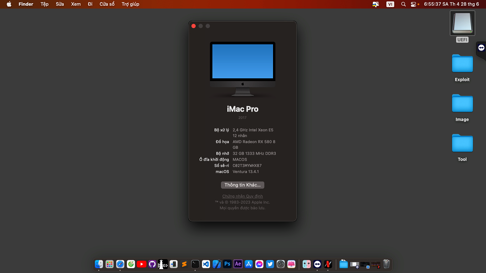

# 
X99 E5-2673 v3 RX580 Hackintosh
 
<h5>EFI Inspired by <a href="https://github.com/vncsmnl/EFI-HUANANZHI-X99-BD4-HACKINTOSH">EFI-HUANANZHI-X99-BD4-HACKINTOSH</a>

## Intro

| | Version |
|-|---------|
| OpenCore | 0.9.3 |
| macOS | Ventura 13.4.1 |

## Desktop Specification

|                     | Specifications| Note |
| ---------------------------- | ---------------------- |------------------|
| ``Chipset``| Intel Wellsburg |   |
| ``CPU``| Intel Xeon E5-2673 v3 2.40GHz |  |
| ``Memory``| 32GB DDR3-1333MHz |  |
| ``dGPU``| AMD Radeon RX 580 8 GB |  |
| ``Ethernet``| RTL8111/8168/8411 PCI Express Gigabit Ethernet Controller | Use [RealtekRTL8111](https://github.com/Mieze/RTL8111_driver_for_OS_X/releases). |
| ``Audio``| Realtek ALC897 | Add `alcid=69` to boot-arg or add layout-id to DeviceProperties. |

## Features

| ``Features``|``Working``| 
|-------------|-----------|
| ``Audio``|✅|
| ``Keyboard``|✅|
| ``Headphone Jack``|✅|
| ``Graphics``|✅|
| ``Power Management``|✅|                                                                   
| ``USB Port``|✅|
| ``Facetime and iMessage``|✅|
| ``Ethernet``|✅|
| ``Sleep``|✅|
